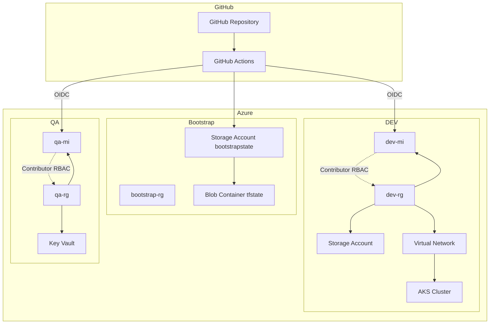
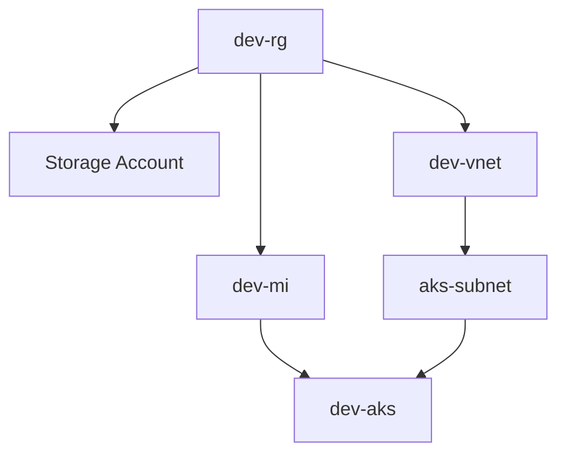
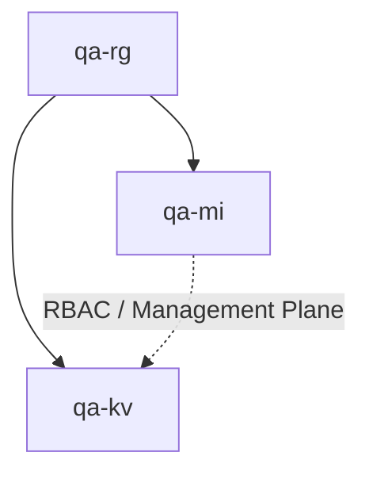
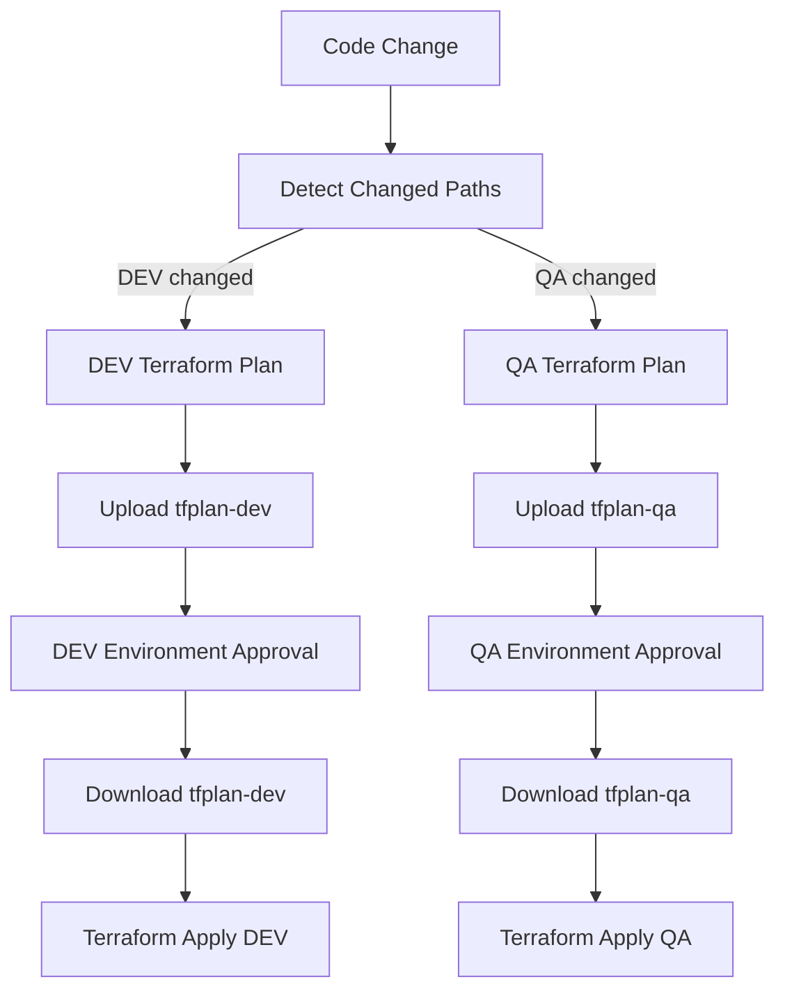

# Azure Terraform GitHub Actions Project

## Overview

This project provisions Azure infrastructure using Terraform and GitHub Actions.

It contains two environments:

- **DEV**
  - Resource Group
  - Storage Account
  - Virtual Network
  - AKS cluster
  - User Assigned Managed Identity

- **QA**
  - Resource Group
  - Key Vault
  - User Assigned Managed Identity

The infrastructure is organized using reusable Terraform modules and environment-specific configurations.

GitHub Actions uses Azure OIDC federation, so no long-lived Azure client secrets are stored in GitHub.

---

## Architecture



### DEV architecture

DEV contains the optional AKS implementation.



The AKS cluster uses:

- Azure CNI Overlay
- Dedicated AKS subnet
- User Assigned Managed Identity
- Restricted Kubernetes API public access
- Single basic system node pool

The Kubernetes API endpoint is public but restricted using authorized IP ranges.

### QA architecture



The Key Vault uses Azure RBAC authorization instead of legacy access policies.

The deployment identity has permission to manage the Key Vault resource but does not receive unnecessary Key Vault data-plane permissions.

---

## Terraform structure

```
terraform/
├── bootstrap/
├── environments/
│   ├── dev/
│   └── qa/
└── modules/
    ├── aks/
    ├── identity/
    ├── key-vault/
    ├── rg/
    ├── storage/
    └── vnet/
```

Each Azure resource is implemented as a separate reusable Terraform module.

Environment-specific configuration is stored under:

```
terraform/environments/dev
terraform/environments/qa
```

---

## Authentication and security

GitHub Actions authenticates to Azure using OpenID Connect (OIDC) federation with User Assigned Managed Identities.

No long-lived Azure client secrets are stored in GitHub.

Separate identities are used for each environment:

- `dev-mi` — used for DEV deployments
- `qa-mi` — used for QA deployments

The identities use least-privilege RBAC:

- `Contributor` scoped to the corresponding environment Resource Group
- `Storage Blob Data Contributor` scoped to the Terraform backend Storage Account
- `Reader` scoped to the Terraform backend Storage Account for management-plane metadata access

GitHub Environments are also separated between plan and apply jobs, allowing Terraform plans to run automatically while infrastructure changes require manual approval.


## Terraform state

Terraform state is stored remotely in Azure Blob Storage.
The AzureRM backend uses Microsoft Entra ID/OIDC authentication (`use_azuread_auth` and `use_oidc`) instead of Storage Account access keys.

```
Storage Account: bootstrapstate
Container:       tfstate
```

DEV and QA use separate backend state keys to keep their states isolated. Example:

```
dev/dev.tfstate
qa/qa.tfstate
```

---

## CI/CD flow

The GitHub Actions workflow automatically detects which environment was changed.



Pull requests run Terraform validation and plan only. Pushes to the deployment branch run:

```
detect changes
→ terraform plan
→ save plan artifact
→ environment approval
→ terraform apply
```

The exact Terraform plan generated by the plan job is applied after approval — no plan is re-generated between review and apply.

### Environment change detection

The pipeline uses path-based filtering.

DEV pipeline is triggered by changes to:

```
terraform/environments/dev/**
terraform/modules/rg/**
terraform/modules/identity/**
terraform/modules/storage/**
terraform/modules/vnet/**
terraform/modules/aks/**
```

QA pipeline is triggered by changes to:

```
terraform/environments/qa/**
terraform/modules/rg/**
terraform/modules/identity/**
terraform/modules/key-vault/**
```

Shared modules such as `rg` and `identity` can trigger both environments.

### GitHub Environments

Four GitHub environments are used:

```
dev-plan
dev
qa-plan
qa
```

Plan environments (`dev-plan`, `qa-plan`) are used for non-interactive Terraform plan execution.

Deployment environments (`dev`, `qa`) require manual approval before `terraform apply`.

---

## Deployment

### Terraform plan (pull request)

```
PR
→ detect changed environment
→ terraform fmt
→ terraform init
→ terraform validate
→ terraform plan
```

### Terraform apply (after merge/push)

```
push
→ detect changed environment
→ terraform plan
→ upload plan artifact
→ GitHub Environment approval
→ download plan artifact
→ terraform apply
```

---

## Design decisions

- Reusable Terraform modules — one module per Azure resource
- Isolated DEV and QA Terraform state (separate backend keys)
- OIDC authentication — no Azure client secrets stored in GitHub
- Separate Azure Managed Identities for DEV and QA (least-privilege, no cross-environment access)
- Path-based environment detection to avoid unnecessary pipeline runs
- Manual approval required before any infrastructure change
- The exact Terraform plan generated pre-approval is what gets applied (no re-plan drift)
- Azure RBAC authorization for Key Vault instead of legacy access policies
- Restricted AKS API access via authorized IP ranges
- The exact Terraform plan generated pre-approval is applied after approval, preventing re-plan drift
- Protected deployment environments — `terraform plan` runs automatically, while `terraform apply` requires GitHub Environment approval